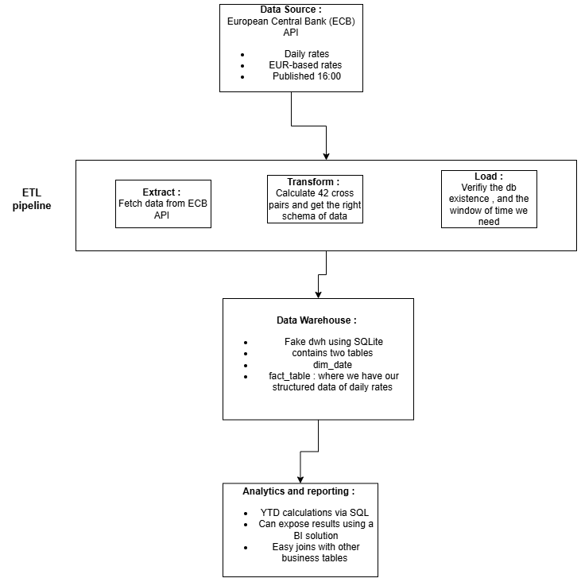
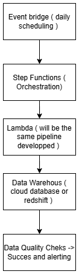

# FX ETL Pipeline Documentation


## Project Overview 


{width="300"}


## Data Source Selection

### ECB Data Portal

**API Documentation:**
- [ECB API Data](https://data.ecb.europa.eu/help/api/data)
- [ECB API Overview](https://data.ecb.europa.eu/help/api/overview)

The European Central Bank (ECB) was selected as the data source for the following reasons:

- All currency pairs involve EU currencies, requiring reliable and authoritative data
- The ECB provides official exchange rate data from a trusted source
- The data is suitable for YTD (Year-to-Date) calculations rather than trading, P&L, or risk calculations
- Provides consistent and standardized data for all required currency pairs

## ETL Pipeline Architecture

The pipeline is organized in a `src` folder containing three main modules: `extract`, `transform`, and `load`. Each module handles a specific step in the data processing workflow.

### 1. Extract

Fetch raw data from the ECB API

- Extracts data using start and end date parameters as specified in the ECB API documentation
- Executes 6 API calls (one for each of the 7 currencies, with EUR as the base currency);EUR serves as the base currency in the ECB API structure

### 2. Transform
Process raw data into the target schema

- Calculates exchange rates for all 42 cross-currency pairs
- Transforms API response format into appropriate keys and values matching the target table schema
- Structures data for efficient database insertion

Additional data quality checks and transformations could be implemented in future iterations,as matter of time constraints I didn't implement them.

### 3. Load

Manage data insertion into the data warehouse

- Verifies existing data to determine if this is an initial load or incremental update
- Checks which up-to-date data already exists in the warehouse
- Inserts transformed data into the SQLite database (serving as a data warehouse for this MVP)

**Data Window:**
- Initial load extracts data from January 1, 2024, to present
- This enables YTD comparisons between 2024 and 2025 for example.

## Setup and Execution

### Prerequisites

- Python or Conda installed on local machine

### Installation Steps

1. **Create a virtual environment:**
   ```bash
   python -m venv venv
   ```

2. **Activate the virtual environment:**
   ```bash
   venv\Scripts\activate
   ```

3. **Install dependencies:**
   ```bash
   pip install -r requirements.txt
   ```

4. **Run the pipeline:**
   ```bash
   python main.py
   ```

### Database Schema

The `setup_database.py` file creates the necessary tables:

**Tables:**
- `dim_date`:Date dimension table
- `fact_fx_rates`:Main exchange rate data

The schema of the main table is as follows: 
- `id` - Primary key
- `date` - Trading date
- `base_currency` - Base currency code
- `quote_currency` - Quote currency code
- `exchange_rate` - FX rate value
- `source` - Data source (ECB in this case, designed to support multiple sources in the future)
- `loaded_at` - Timestamp (with mm:ss precision) of when the data was loaded

**Future Enhancement:** Dockerization using a Dockerfile for containerized deployment in order to run it using docker on other developer's machine. 

## SQL Queries and YTD Analysis

### YTD Calculation Use Cases

Year-to-Date calculations enable:
- Tracking currency appreciation or depreciation since the beginning of the year
- Calculating average currency rates over the year
- Comparative analysis across different time periods

### Query Examples

The `queries` folder contains `run_queries.py` with three test queries:

1. **Currency Lookup Query**
   - Retrieves specific currency pair data (e.g., NOK/EUR)

2. **Rate Statistics Query**
   - Calculates statistics for selected currencies in 2025

3. **YTD Analysis Query**
   - Examines YTD performance for all currencies since January 2025

**Output Format:** Results are displayed in pandas DataFrames for simplicity. Future enhancements could include JSON exports or file-based outputs.

## How we can orchestrate/run the pipline in a rgular basis ?

### AWS Cloud Architecture

The pipeline is designed for deployment as a cloud-based daily batch workflow using AWS services.

**Architecture Components:**

{width="300"}


The existing Python pipeline (FX extraction, transformation, and load) will be deployed as an AWS Lambda function and executed as a daily batch workflow in the cloud.

EventBridge schedules the pipeline once per day after ECB FX rates are published.

Step Functions orchestrates the execution, controls the order of steps, handles retries, and manages failures.

Lambda runs the already implemented Python code to fetch FX rates, transform them, and load them directly into the data warehouse.

The data warehouse in this case could be a RDS ( Postegresql) or directly to redshift. 

Data quality checks ensure completeness and validity of the loaded data.

The workflow ends in success or alerting depending on execution outcome.

This design reuses existing code, keeps the pipeline warehouse-centric, and provides reliable scheduling and observability with minimal infrastructure.


